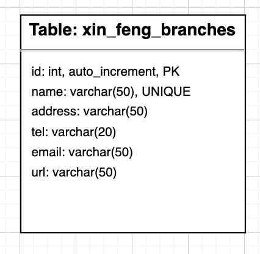

# Exercise 5: Readme.md

***Welcome to the task README!***

# Project Name - Team 18

This website features user management (including administrator permission management), menu and menu management, reservations and reservation management, as well as the display and management of website feedback and reviews.

## Table of Contents
- [Exercise 5: Readme.md](#exercise-5-readmemd)
- [Project Name - Team 18](#project-name---team-18)
  - [Table of Contents](#table-of-contents)
  - [Features](#features)
    - [Feature 1](#feature-1)
    - [Feature 2](#feature-2)
    - [Feature 3](#feature-3)
    - [Feature 4](#feature-4)
    - [Feature 5](#feature-5)
    - [Feature 6](#feature-6)
    - [Feature 7](#feature-7)
    - [Feature 8](#feature-8)
    - [Feature 9](#feature-9)
    - [Feature 10](#feature-10)
    - [Feature 11](#feature-11)
  - [Database Tables](#database-tables)
  - [Created Forms](#created-forms)
  - [Created Tables](#created-tables)

---

## Features

In this section, list and describe the features or functionality that you are working on. You can use checkboxes to track the progress of each feature.

- [ ] Feature 1 Xin FENG: Branches information presentation.
- [ ] Feature 2 Xin FENG: Branches information management page.
- [ ] Feature 3 Xin FENG: New/edit a branch page, and database modification operations.
- [ ] Feature 4 Jin LU: Online Reservation
- [ ] Feature 5 Jin LU: Reservation management
- [ ] Feature 6 Mu ZHAO: Online feedback
- [ ] Feature 7 Mu ZHAO: Reviews presentation
- [ ] Feature 8 Mu ZHAO: Admin feedback management
- [ ] Feature 9 Xingxing WANG: Menu presentation
- [ ] Feature 10 Xingxing WANG: Admin menu management
- [ ] Feature 11 Xingxing WANG: Menu search

### Feature 1

A simple **table-like** page to show branches to visitors.
- **Selects** reads and prints data from database table xin_feng_branches. (in feature1.php)
(github: [feature1.php](https://github.com/DanielF2002/PHP_team18/blob/main/feature1.php)) | Link to the form (shell.hamk.fi)

### Feature 2

- **table** for admin to manage the branches. The data is from database table xin_feng_branches.
There are 3 buttons: insert, update and delete. (in feature2.php)
- **Javascript** to add a comfirm button when admin clicking the delete button. (in feature2.php)
(github: [feature2.php](https://github.com/DanielF2002/PHP_team18/blob/main/feature2.php)) | Link to the form (shell.hamk.fi)

### Feature 3

A **form** for admin to insert, update the branch. The update feature can ONLY valid when admin clicking the update button on feature2.
A feedback page to return all admin modifications to the database, and logic of database insert, update, and delete.
- **Form** xin_feng_branches_form with **Validation** feature by **Javascript**. (in feature3.php)
- **Filter** the database table xin_feng_branches. (in feature3.php)
- **Insert**, **Edit**, **Delete**, the database table xin_feng_branches. (in feature3_result.php)
- (github: [feature2.php](https://github.com/DanielF2002/PHP_team18/blob/main/feature3.php)) [feature3_result.php](https://github.com/DanielF2002/PHP_team18/blob/main/feature3_result.php))| Link to the form (shell.hamk.fi)

### Feature 4

Reservation page is for customer to make their bookings online. 
- **Form** for users to submit their booking details online, data goes to jinLu_bookinginfo table. It is validated and by submitted by **Javascript**.

### Feature 5

Reservation management. A page for admin to check, search, modify and cancel a reservation.
- **Table** to show all booking information to admin. All data are connected with table jinLu_bookinginfo. admin can also make changes (CRUD) the bookinginfo table.
- **Form** for admin to edit the selected data.

### Feature 6

Reviews presention. A page for user to read the reviews, includes a table, and database interaction.

### Feature 7

Reviews presention. A page for user to read the reviews.

### Feature 8

Admin menu management. A page for admin, includes query, search, delete, and modify a table.

### Feature 9

Menu presention. A page for user to read the menu, includes a table, and database interaction.

### Feature 10

Admin menu management. A page for admin to query, search, delete, and modify a table..

### Feature 11

Menu search. A page for user to filter the database by keyword.

---

## Database Tables

List the database tables that are part of your project. 

- Table 1 (Created By Xin FENG): xin_feng_branches
- Table 2 (Created By Jin LU): RESERVATION
- Table 3 (Created By Mu ZHAO): FEEDBACK
- Table 4 (Created By Xingxing WANG): MENU
> Include the ER Diagram of the database.

---

## Created Forms

List and describe any forms that have been created as part of your project. Include details about the purpose of each form and any validation logic.

- Form 1 (Created By Xin FENG): Form Name: xin_feng_branches_form, Link to the related code file (github: [feature2.php](https://github.com/DanielF2002/PHP_team18/blob/main/feature2.php)) | Link to the form (shell.hamk.fi). | Validations Applied
- Form 2 (Created By Jin LU): Form Name: Reservation, Link to the related code file (github) | Link to the form (shell.hamk.fi). | Validations Applied
- Form 3 (Created By Jin LU): Form Name: Booking modification, Link to the related code file (github)([github]:https://github.com/DanielF2002/PHP_team18/blob/main/reservation.php) & ([github]: https://github.com/DanielF2002/PHP_team18/blob/main/editReservation.php) | Link to the form (shell.hamk.fi). | Validations Applied
- Form 4 (Created By Mu ZHAO): Form Name: Feedback, Link to the related code file (github) | Link to the form (shell.hamk.fi). | Validations Applied
- Form 5 (Created By Xingxing WANG): Form Name: MenuSearch, Link to the related code file (github) | Link to the form (shell.hamk.fi). | Validations Applied

---

## Created Tables

List any tables that you have created in the project work

- Table 1 (Created By Xin FENG): Table Name: xin_feng_branches| Link to the related code file (github: [feature2.php]:(https://github.com/DanielF2002/PHP_team18/blob/main/feature2.php)) | Link to the table (shell.hamk.fi).
- Table 2 (Created By Jin LU): Table Name: jinLu_bookinginfo | Link to the related code file (github)([github]:https://github.com/DanielF2002/PHP_team18/blob/main/adminReservation.php) | Link to the table (shell.hamk.fi).
- Table 3 (Created By Mu ZHAO): Table Name: Feedback | Link to the related code file (github) | Link to the table (shell.hamk.fi).
- Table 4 (Created By Xingxing WANG): Table Name: Menu | Link to the related code file (github) | Link to the table (shell.hamk.fi).

---
