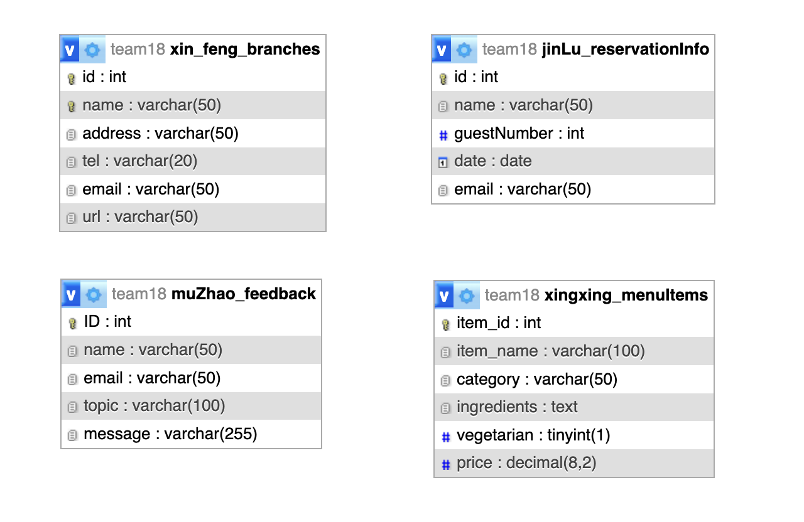

# Exercise 5: Readme.md

# Midnight Sun Bistro - Team 18

This website is created for a restaurant, features include links to other branch restaurants, menu display, online reservation, and a feedback and review system, and management functionalities.

## Table of Contents
- [Exercise 5: Readme.md](#exercise-5-readmemd)
- [Project Name - Team 18](#project-name---team-18)
  - [Table of Contents](#table-of-contents)
  - [Features](#features)
    - [Feature 1](#feature-1)
    - [Feature 2](#feature-2)
    - [Feature 3](#feature-3)
    - [Feature 4](#feature-4)
    - [Feature 5](#feature-5)
    - [Feature 6](#feature-6)
    - [Feature 7](#feature-7)
    - [Feature 8](#feature-8)
    - [Feature 9](#feature-9)
    - [Feature 10](#feature-10)
  - [Database Tables](#database-tables)
  - [Created Forms](#created-forms)
  - [Created Tables](#created-tables)

---

## Features

In this section, list and describe the features or functionality that you are working on. You can use checkboxes to track the progress of each feature.

- [x] Feature 1 Xin FENG: Branches information presentation. (github: [feature1.php](https://github.com/DanielF2002/PHP_team18/blob/main/feature1.php)) | shell
- [x] Feature 2 Xin FENG: Branches information management page. (github: [feature2.php](https://github.com/DanielF2002/PHP_team18/blob/main/feature2.php)) | shell
- [x] Feature 3 Xin FENG: New/edit a branch page, and database modification operations. (github: [feature3.php](https://github.com/DanielF2002/PHP_team18/blob/main/feature3.php) [feature3_result.php](https://github.com/DanielF2002/PHP_team18/blob/main/feature3_result.php) [feature3_validation.js](https://github.com/DanielF2002/PHP_team18/blob/main/js/feature3_validation.js)) | shell
- [x] Feature 4 Jin LU: Online Reservation
- [x] Feature 5 Jin LU: Reservation management
- [ ] Feature 6 Mu ZHAO: Online  feedback  
- [ ] Feature 7 Mu ZHAO: Feedback management
- [x] Feature 8 Xingxing WANG: Menu presentation
- [x] Feature 9 Xingxing WANG: Admin menu management
- [x] Feature 10 Xingxing WANG: Menu search

### Feature 1

A simple **table-like** page to show branches to visitors.
- **Selects** and prints data from database table xin_feng_branches. (in feature1.php)

(github: [feature1.php](https://github.com/DanielF2002/PHP_team18/blob/main/feature1.php)) | Link to the form (shell.hamk.fi)

### Feature 2

- **table** for admin to manage the branches. The data is from database table xin_feng_branches.
There are 3 buttons: insert, update and delete. (in feature2.php)
- **Javascript** to add a comfirm button when admin clicking the delete button. (in feature2.php)

(github: [feature2.php](https://github.com/DanielF2002/PHP_team18/blob/main/feature2.php)) | Link to the form (shell.hamk.fi)

### Feature 3

A **form** for admin to insert, update the branch. The update feature can ONLY valid when admin clicking the update button on feature2.
A feedback page to return all admin modifications to the database, and logic of database insert, update, and delete.
- **Form** xin_feng_branches_form. (in feature3.php)
- **Validation** feature by **Javascript**. (in feature3_validation.js)
- **Filter** the database table xin_feng_branches. (in feature3.php)
- **Insert**, **Edit**, **Delete**, the database table xin_feng_branches. (in feature3_result.php)

(github: [feature3.php](https://github.com/DanielF2002/PHP_team18/blob/main/feature3.php) [feature3_result.php](https://github.com/DanielF2002/PHP_team18/blob/main/feature3_result.php) [feature3_validation.js](https://github.com/DanielF2002/PHP_team18/blob/main/js/feature3_validation.js)) | Link to the form (shell.hamk.fi)

### Feature 4

Reservation page is for customer to make their bookings online. 
- **Form** for users to submit their booking details online, data goes to jinLu_reservationInfo table. It is validated and by submitted by **Javascript**.
(github: [reservation.php](https://github.com/DanielF2002/PHP_team18/blob/main/reservation.php)) | Link to the form (shell.hamk.fi)

### Feature 5

Reservation management. A page for admin to check, search, modify and cancel a reservation.
- **Table** to show all booking information to admin. All data are connected with table jinLu_reservationInfo. admin can also make changes (CRUD) to the bookinginfo table.
(github: [reservationAdmin.php](https://github.com/DanielF2002/PHP_team18/blob/main/reservationAdmin.php)) | Link to the form (shell.hamk.fi)
- **Form** for admin to edit the selected data.
(github: [reservationEdit.php](https://github.com/DanielF2002/PHP_team18/blob/main/reservationEdit.php)) | Link to the form (shell.hamk.fi)

### Feature 6

A page for user to submit the feedback inforamtion, includes a table, and database interaction.
- **Form** for users to submit the feedback information, all datas go to muZhao_feedback table. Validation function in **Javascript** to validate the form.(feedback.php)
(github: [feedback.php](https://github.com/DanielF2002/PHP_team18/blob/main/feedback.php)) | Link to the form (shell.hamk.fi)

### Feature 7

Feedback management. A page for admin, includes query, search, delete, and modify a table.
- **Form** for admin to edit the selected data.
- **Table** displaying all feedback for the admin's review, allowing the admin to perform CRUD operations on the "muZhao_feedback" table.
(github: [feedbackAdmin.php](https://github.com/DanielF2002/PHP_team18/blob/main/feedbackAdmin.php)) | Link to the form (shell.hamk.fi)

### Feature 8

Menu page for customer. 
- **Table** for customer to read menu items from database table xingxing_menuItems.
- **Filter** the database table xingxing_menuItems by category.

(github: [menu.php](https://github.com/DanielF2002/PHP_team18/blob/main/menu.php)) | Link to the feature (http://shell.hamk.fi/~xingxing23000/PHP_team18/menu.php)

### Feature 9

Menu management for admin.
- **Table** for admin to read, add, update, delete the the menu items in database table xingxing_menuItems.
  [menu_admin.php](https://github.com/DanielF2002/PHP_team18/blob/main/menu_admin.php)
- **Forms** for admin to insert and upfate menu items.
  [menu_admin_create.php](https://github.com/DanielF2002/PHP_team18/blob/main/menu_admin_create.php)
  [menu_admin_update.php](https://github.com/DanielF2002/PHP_team18/blob/main/menu_admin_update.php)
- **Javascript** to validate form input and add a comfirm button for deleting menu item. 

(github: [menu_admin.php](https://github.com/DanielF2002/PHP_team18/blob/main/menu_admin.php)) | Link to the feature (http://shell.hamk.fi/~xingxing23000/PHP_team18/menu_admin.php)

### Feature 10

- Menu search for admin in menu management page.

(github: [menu_admin.php](https://github.com/DanielF2002/PHP_team18/blob/main/menu_admin.php)) | Link to the feature (http://shell.hamk.fi/~xingxing23000/PHP_team18/menu_admin.php)

---

## Database Tables

List the database tables that are part of your project. 

- Table 1 (Created By Xin FENG): xin_feng_branches
- Table 2 (Created By Jin LU): RESERVATION
- Table 3 (Created By Mu ZHAO): FEEDBACK
- Table 4 (Created By Xingxing WANG): MENU
> Include the ER Diagram of the database.
The ER Diagram of the database:

---

## Created Forms

List and describe any forms that have been created as part of your project. Include details about the purpose of each form and any validation logic.

- Form 1 (Created By Xin FENG): Form Name: xin_feng_branches_form, Link to the related code file (github: [feature3.php](https://github.com/DanielF2002/PHP_team18/blob/main/feature3.php)) | Link to the form (shell.hamk.fi). | Validations Applied
- Form 2 (Created By Jin LU): Form Name: reservationForm, Link to the related code file (github)([reservation.php](https://github.com/DanielF2002/PHP_team18/blob/main/reservation.php)) | Link to the form (shell.hamk.fi). | Validations Applied
- Form 3 (Created By Jin LU): Form Name: reservationEditForm, Link to the related code file (github)([reservationEdit.php](https://github.com/DanielF2002/PHP_team18/blob/main/reservationEdit.php)) | Link to the form (shell.hamk.fi). | Validations Applied
- Form 4 (Created By Mu ZHAO): Form Name: feedbackForm, Link to the related code file (github) ([feedback.php](https://github.com/DanielF2002/PHP_team18/blob/main/feedback.php))| Link to the form (shell.hamk.fi). | Validations Applied
- Form 5 (Created By Mu ZHAO): Form Name: feedbackForm, Link to the related code file (github) ([feedbackEdit.php](https://github.com/DanielF2002/PHP_team18/blob/main/feedbackEdit.php))| Link to the form (shell.hamk.fi). | Validations Applied
- Form 6 (Created By Xingxing WANG): Form Name: menu_insert, Link to the related code file (github: [menu_admin_create.php](https://github.com/DanielF2002/PHP_team18/blob/main/menu_admin_create.php)) | Link to the form (http://shell.hamk.fi/~xingxing23000/PHP_team18/menu_admin_create.php). | Validations Applied
- Form 7 (Created By Xingxing WANG): Form Name: menu_update, Link to the related code file (github: [menu_admin_update.php](https://github.com/DanielF2002/PHP_team18/blob/main/menu_admin_update.php)) | Link to the form (http://shell.hamk.fi/~xingxing23000/PHP_team18/menu_admin_update.php). | Validations Applied

---

## Created Tables

List any tables that you have created in the project work

- Table 1 (Created By Xin FENG): Table Name: xin_feng_branches| Link to the related code file (github: [feature2.php](https://github.com/DanielF2002/PHP_team18/blob/main/feature2.php)) | Link to the table (shell.hamk.fi).
- Table 2 (Created By Jin LU): Table Name: jinLu_reservationInfo | Link to the related code file (github)([reservation.php](https://github.com/DanielF2002/PHP_team18/blob/main/adminReservation.php))| Link to the table (shell.hamk.fi).
- Table 3 (Created By Mu ZHAO): Table Name: muZhao_feedback | Link to the related code file (github)([feedbackAdmin.php](https://github.com/DanielF2002/PHP_team18/blob/main/feedbackAdmin.php)) | Link to the table (shell.hamk.fi).
- Table 4 (Created By Xingxing WANG): Table Name: Menu | Link to the related code file (github: [menu_admin.php](https://github.com/DanielF2002/PHP_team18/blob/main/menu_admin.php)) | Link to the table (http://shell.hamk.fi/~xingxing23000/PHP_team18/menu_admin.php).

---
